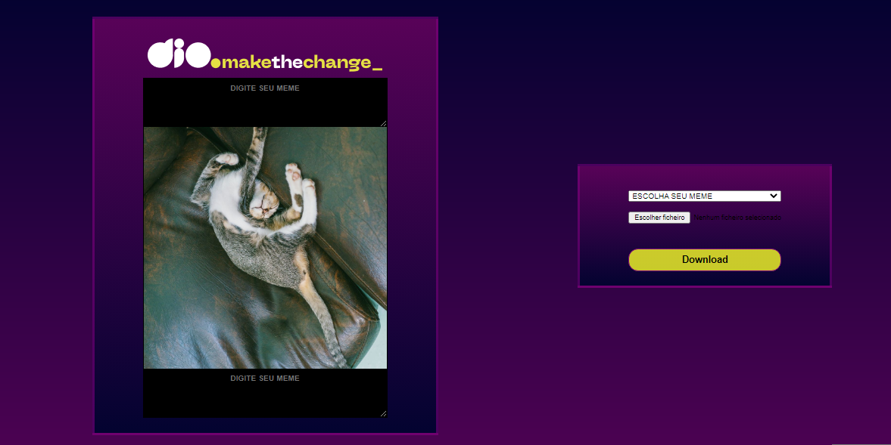

# Máquina de Memes 🤓🥴🤣

> Evento da DIO para criar um gerador de memes.

- Esse é o layout da página: 

- Como fica o meme após o download: 

## 🛸 Tecnologias utilizadas:
    - HTML,
    - CSS,
    - JavaScript,
    - Git e Github.

[Teste você também, crie o seu próprio Meme clicando aqui! 👈](https://tiemi9.github.io/Maquina-de-Memes_DIO/)

## 🤳 Contato

[Me econtre no Linkedin 🔗](https://www.linkedin.com/in/cristiemim9/)

## 🥂 Agradecimentos

_À toda equipe da Dio pela oportunidade de desenvolver esse projeto divertido e cheio de conteúdo que só agregam conhecimento e principalmente ao Felipe Aguiar que compartilhou sua linha de raciocínio e conhecimento de forma lúdica e de fácil compreensão. Só o que quero agora, é codar e decolar!!!🚀_ 